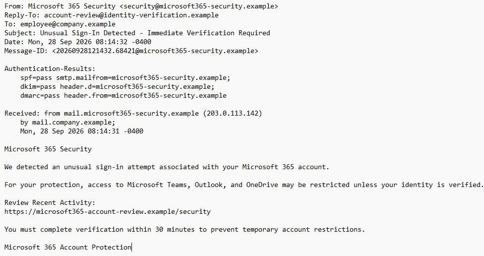
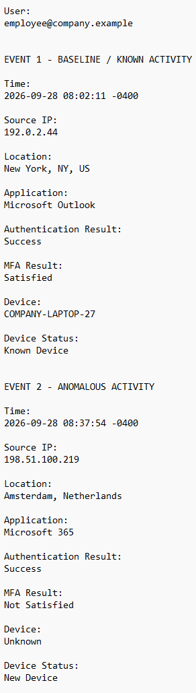
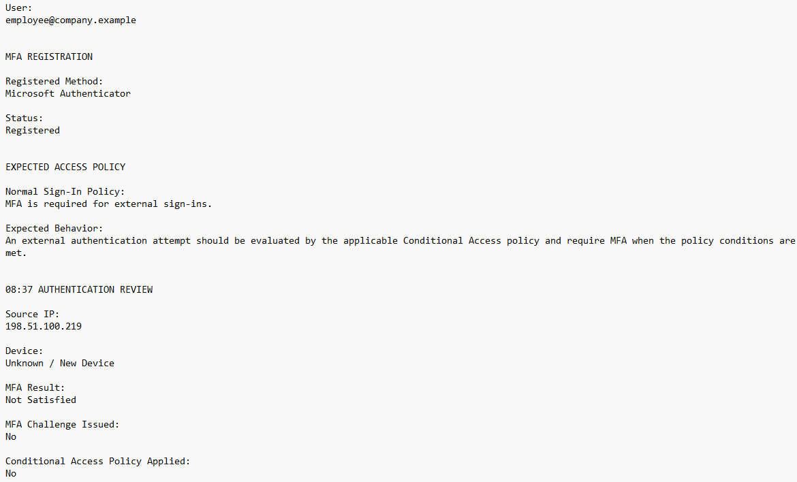
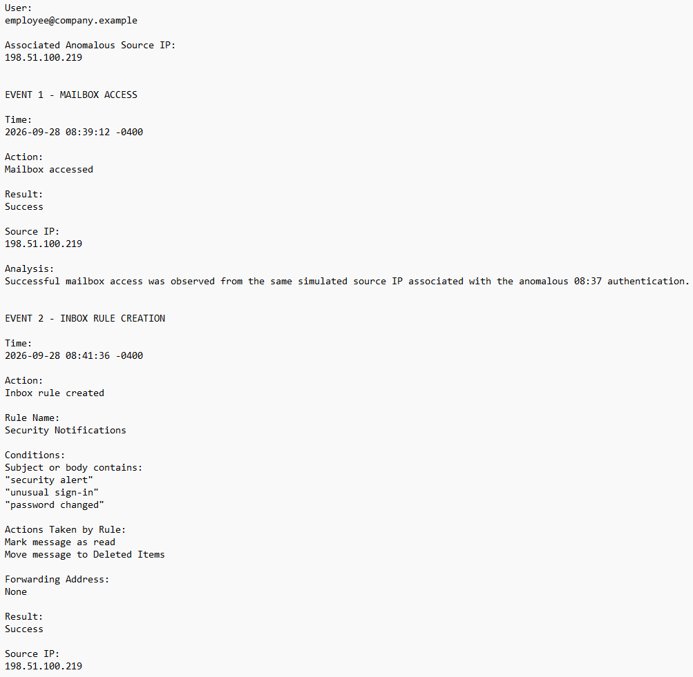
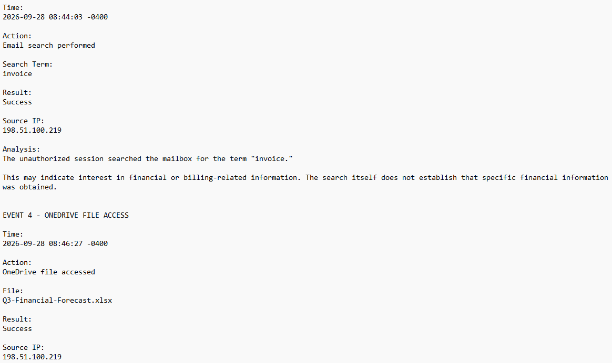
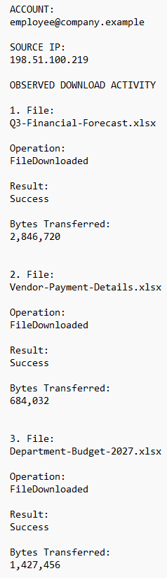
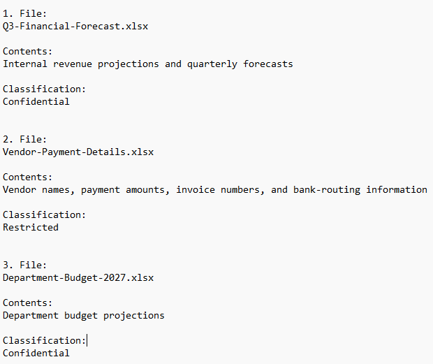

# Case 03 — Full Phishing Incident Investigation

## Overview

This case simulates an end-to-end SOC investigation of a credential-phishing incident that progressed from initial phishing delivery to Microsoft 365 account compromise and confirmed data exfiltration.

The investigation follows the incident from the initial email through user interaction, unauthorized authentication, post-compromise mailbox and OneDrive activity, data exfiltration, containment, escalation, and final incident classification.

All domains, IP addresses, accounts, and incident artifacts used in this case are simulated or reserved training values. No real credentials, malware, accounts, or organizational data were used.

## Investigation Objectives

- Analyze a suspicious Microsoft 365 phishing email and identify phishing indicators.

- Evaluate SPF, DKIM, and DMARC results without treating successful authentication as proof of legitimacy.

- Investigate reported credential submission and correlate it with Microsoft 365 authentication activity.

- Distinguish an MFA/Conditional Access configuration gap from an MFA bypass.

- Investigate post-compromise mailbox and OneDrive activity.

- Determine whether sensitive organizational data was accessed or exfiltrated.

- Map observed attacker behavior to MITRE ATT\&CK techniques.

- Develop appropriate containment, escalation, and remediation recommendations.

- Document the incident using evidence-based SOC reporting practices.

## Incident Summary

A simulated Microsoft 365 security email was delivered to an employee and directed the user to a credential-harvesting website. Although the sender domain passed SPF, DKIM, and DMARC authentication, investigation identified a lookalike domain, a mismatched Reply-To domain, urgency, threatened account restrictions, and a link to a separate credential-verification domain.

The employee reported clicking the phishing link and submitting their work email address and password. Shortly afterward, a successful Microsoft 365 authentication was observed from source IP `198.51.100.219` using a new/unknown device.

Investigation of the unauthorized session identified mailbox access, creation of an inbox rule targeting security notifications, a mailbox search for "invoice," OneDrive access, and successful downloads of three Confidential or Restricted financial files.

The incident was classified as **High severity** due to confirmed cloud account compromise and data exfiltration.

## Investigation Timeline

| Time | Event | Finding |
| --- | --- | --- |
| 08:02 | Legitimate authentication | Successful Microsoft 365 authentication from New York using the employee's known company device. MFA satisfied. |
| 08:14 | Phishing email received | Simulated Microsoft 365 credential-phishing email delivered to the employee. |
| After 08:14 | User interaction | Employee reported clicking the phishing link and submitting work credentials. |
| 08:37 | Unauthorized authentication | Successful authentication from `198.51.100.219` using a new/unknown device. |
| 08:41 | Inbox rule created | Unauthorized session created a rule targeting security-related notifications. |
| 08:44 | Mailbox search | Unauthorized session searched the mailbox for `"invoice"`. |
| 08:46+ | OneDrive activity | Unauthorized session accessed OneDrive and financial data. |
| Subsequent activity | Data exfiltration | Three Confidential or Restricted financial files were successfully downloaded. |

## Phishing Email Analysis

Initial analysis identified several indicators consistent with credential phishing:

- The sender used a Microsoft 365 lookalike domain.

- The Reply-To address used a different domain from the sender.

- The message used urgency and threatened account restrictions to encourage immediate action.

- The embedded link directed the employee to a separate credential-verification domain.

- SPF, DKIM, and DMARC all passed; however, these results only established authentication and alignment for the sending domain and did not establish that the domain belonged to Microsoft.

**Analyst Finding:** Successful SPF, DKIM, and DMARC authentication should not be treated as proof that an email is legitimate. An attacker-controlled lookalike domain can be configured with valid email-authentication records.

## Account Compromise Investigation

The employee reported submitting their work credentials to the simulated credential-harvesting page. Authentication activity was then reviewed to determine whether the credentials had been used.

A baseline authentication occurred at 08:02 from New York using the employee's known company device with MFA satisfied.

At 08:37, a second successful Microsoft 365 authentication was observed with the following characteristics:

- Source IP: `198.51.100.219`

- Location: Amsterdam, Netherlands

- Device: New / Unknown

- Authentication Result: Success

- MFA Result: Not Satisfied

When correlated with the employee's reported credential submission and the subsequent unauthorized activity, the evidence supported confirmed compromise of the employee's Microsoft 365 account.

**Analyst Finding:** Geographic differences alone should not be treated as proof of account compromise because VPNs, proxies, and IP geolocation can affect apparent location. The conclusion was based on the combined evidence of reported credential submission, successful authentication from a new/unknown device, and subsequent unauthorized account activity.

## MFA / Conditional Access Investigation

The unauthorized authentication initially showed an MFA result of **Not Satisfied**. Additional authentication-control evidence was reviewed to determine whether the attacker had bypassed MFA.

The review identified:

- Registered MFA Method: Microsoft Authenticator

- MFA Result: Not Satisfied

- MFA Challenge Issued: No

- Conditional Access Policy Applied: No

The employee account had been unintentionally excluded from the organization's Conditional Access policy requiring MFA for external sign-ins. Because the policy was not applied, no MFA challenge was issued during the unauthorized authentication.

**Analyst Finding:** The available evidence supports a Conditional Access configuration gap rather than an MFA bypass. An MFA bypass would imply that an MFA control was applied and subsequently defeated, circumvented, or otherwise overcome. In this incident, the expected MFA control was never applied.

## Post-Compromise Activity

Following the unauthorized authentication, activity from source IP `198.51.100.219` was investigated to determine what actions occurred within the compromised account.

Observed activity included:

- Successful mailbox access

- Creation of an unauthorized inbox rule

- Mailbox search for `"invoice"`

- OneDrive file access

The unauthorized inbox rule, named **Security Notifications**, was configured to identify messages containing terms such as `"security alert"`, `"unusual sign-in"`, and `"password changed"`. Matching messages were marked as read and moved to Deleted Items.

The rule contained **no forwarding address**, so the evidence did not establish external email forwarding. Its configuration was consistent with an attempt to reduce the likelihood that the account owner would notice security-related notifications.

**Analyst Finding:** The activity demonstrates that the incident progressed beyond credential exposure and unauthorized authentication. The compromised account was actively used to access the employee's mailbox, modify mailbox behavior, search for financial-related information, and access OneDrive.

## Data Exfiltration Investigation

OneDrive audit activity associated with the unauthorized session was reviewed to determine whether organizational files were merely accessed or actually transferred.

Three successful `FileDownloaded` events were identified from source IP `198.51.100.219`:

| File | Classification | Bytes Transferred |
| --- | --- | ---: |
| Q3-Financial-Forecast.xlsx | Confidential | 2,846,720 |
| Vendor-Payment-Details.xlsx | Restricted | 684,032 |
| Department-Budget-2027.xlsx | Confidential | 1,427,456 |

Content review determined that the files contained:

- Internal revenue projections and quarterly forecasts

- Vendor names, payment amounts, invoice numbers, and bank-routing information

- Department budget projections

Because the audit records showed successful file-download operations during the unauthorized session, the evidence supports **confirmed data exfiltration** of these three files.

The available evidence does not establish exfiltration of additional files beyond those identified during the investigation.

**Analyst Finding:** File access alone would not have been sufficient to establish data exfiltration. The successful `FileDownloaded` events provided the additional evidence necessary to determine that the three identified files were transferred during the unauthorized session.

## MITRE ATT&CK Mapping

The observed activity was mapped to the following MITRE ATT&CK techniques:

| Technique | Name | Evidence |
| --- | --- | --- |
| T1566.002 | Phishing: Spearphishing Link | The phishing email delivered a link to the simulated credential-harvesting website. |
| T1204.001 | User Execution: Malicious Link | The employee reported clicking the phishing link. |
| T1056.003 | Input Capture: Web Portal Capture | The employee reported submitting work credentials to the simulated login page. |
| T1078.004 | Valid Accounts: Cloud Accounts | The compromised employee account was used for the successful unauthorized Microsoft 365 authentication. |
| T1530 | Data from Cloud Storage | The unauthorized session accessed and successfully downloaded financial files from OneDrive. |
| T1564.008 | Hide Artifacts: Email Hiding Rules | The unauthorized session created an inbox rule that marked security-related messages as read and moved them to Deleted Items. |

**Analyst Finding:** ATT&CK mapping was based on behaviors supported by the available evidence. Techniques were not added solely because they could have occurred during this type of attack.

## Containment and Remediation

Following confirmation of the account compromise and data exfiltration, the following containment and remediation actions were identified:

- Reset the compromised employee's Microsoft 365 password.

- Revoke active sessions and authentication tokens associated with the account.

- Remove the unauthorized inbox rule.

- Correct the unintended Conditional Access exclusion and verify that the employee is covered by the organization's MFA requirement for external sign-ins.

- Search Microsoft 365 audit and authentication logs for additional unauthorized activity associated with the account and source IP `198.51.100.219`.

- Review affected vendor and payment processes for potential follow-on financial fraud.

- Preserve relevant email, authentication, mailbox, OneDrive, and audit evidence for continued investigation.

The incident should also be escalated through the organization's established incident-response process to appropriate Security, Incident Response, Identity/Microsoft 365 Administration, Finance/Accounts Payable, Legal/Privacy/Compliance, and management personnel.

**Analyst Finding:** Password reset alone should not be treated as complete containment of an actively compromised cloud account. Existing authenticated sessions or tokens should also be addressed, and the security-control gap that allowed the unauthorized authentication should be remediated.

## Final Assessment

The investigation confirmed a successful credential-phishing incident that progressed to Microsoft 365 account compromise and confirmed data exfiltration.

The employee reported submitting work credentials to a simulated credential-harvesting website. Those credentials were subsequently associated with a successful unauthorized Microsoft 365 authentication from a new/unknown device.

The unauthorized session accessed the employee's mailbox, created an inbox rule targeting security-related notifications, searched for financial-related information, accessed OneDrive, and successfully downloaded three financial files.

The incident was classified as:

**Malicious — Credential Phishing Resulting in Cloud Account Compromise and Confirmed Data Exfiltration**

**Severity: High**

The High severity classification was based on:

- Confirmed unauthorized access to the employee's Microsoft 365 account.

- Confirmed exfiltration of three Confidential or Restricted financial files, including vendor/payment and bank-routing information.

- Potential financial and business impact resulting from exposure of the affected information.

The investigation established exfiltration of the three identified files. The available evidence did not establish additional data exfiltration, external email forwarding, or follow-on Business Email Compromise or payment fraud.

**Analyst Finding:** Severity was determined from the demonstrated impact of the incident rather than the phishing email alone. The incident progressed from credential exposure to confirmed account compromise and unauthorized transfer of sensitive organizational data.

